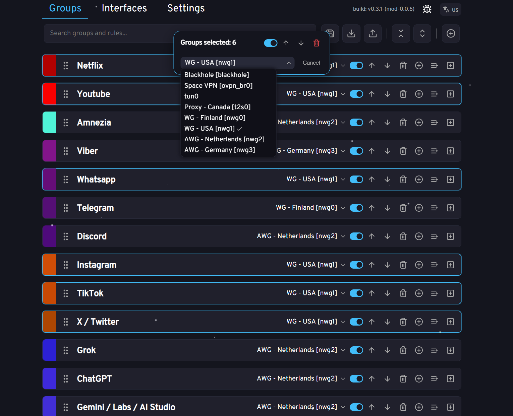

<div align="center">
  <h1>$\color{green}{\text{EN}}$ | <a href="README_RU.md">RU</a></h1>

</div>
<br/>

<p align="center">
  
</p>


MagiTrickle Mod
=======

## Purpose

**MagiTrickle Mod** is an extended version of the MagiTrickle utility designed for selective traffic routing based on domain names. It acts as an installation package installed on top of the router's operating system.

The principle of operation operates by intercepting the main DNS server via an intermediate component without disabling it. This allows capturing incoming DNS requests, caching responses, and mapping IP addresses to domain names. This enables traffic routing without the need to clear the client-side DNS cache. Cache clearing is only required when starting or restarting the MagiTrickle service, as the cache is cold at that moment, and routing is not possible until the first request to the target domain is made

### Mod Features vs Original

#### 🚀 Performance & Optimization
*   **Trie (Prefix Tree) Lookup**: The original version iterates through rules linearly. The Mod uses a Prefix Tree (Trie), allowing for instant interface lookup even among thousands of domains
*   **iptables**: Reduced number of iptables rules by creating a single rule for all groups with the same interface. A side effect is faster group config saving
*   **TrafficManager**: More efficient traffic handling by checking rules in blocks: first all Namespace rules (via Trie), then Wildcard, and finally Regexp expressions, rather than sequential iteration
*   **Other improvements** in performance when adding/removing/enabling/disabling groups and rules

#### 🛠 Improved User Interface (UX)
*   **Tabs**: Interface is divided into logical tabs: `Groups`, `Interfaces`, `Settings`
*   **Interface Shortcuts**: Ability to assign aliases to system interfaces (e.g., `nwg0` -> `WireGuard - Netherlands`)
*   **Mass Actions**:
    *   Multi-selection of groups using Shift/Ctrl
    *   Mass deletion, moving, **enabling/disabling**, interface assignment for groups, and group deletion
    *   Ability to value collapse/expand all groups
    *   Mass **enabling/disabling** of rules within a group, as well as mass rule deletion
    *   TODO: mass rule selection; dragging rules between groups; etc
    *   Other UI/UX improvements
*   **Mobile Adaptive**: Full interface adaptation for mobile devices
    *   **Bottom Navigation**: Convenient navigation between tabs via a bottom bar
    *   **Mobile Controls**: Adapted controls, menus, and lists for touch screens
    *   **Mobile Bulk Actions**: Support for multi-selection and bulk actions with groups on smartphones

#### ⚙️ New Features
*   **Speedtest**: Built-in utility for measuring connection speed directly from the router
    *   **Interface Binding**: Ability to test speed **through a specific interface** (e.g., inside a VPN tunnel), ignoring the default gateway
*   **Lists Import**: Built-in search and download of popular community lists (e.g. Google, Telegram, Apple) directly from `v2fly/domain-list-community`
*   **Export/Import Config**: Enhanced system for exporting/importing group configurations with support for selective export
*   **Auto-Update**: System for automatic checking and installing mod updates directly from the web interface
    *   Notifications about new versions
    *   One-click update (no console required)
*   **Regexp Toggle**: Ability to fully disable the regular expression engine in settings for maximum performance
*   **Wildcards Toggle**: Ability to fully disable the wildcard engine in settings for maximum performance
*   **Console/Logger**: Built-in log viewer (`ConsoleWindow`) directly in the web interface
    *   Ability to change logging level in settings
*   **Restart Service**: Ability to restart the service from the web interface

### Screenshots

| Groups (Main) | Bulk Edit |
|:---:|:---:|
|  |  |

| Interfaces | Speedtest |
|:---:|:---:|
|  |  |

| Settings | |
|:---:|:---:|
|  | |

## Installation (Automatic)
Recommended for both **Entware** and **OpenWRT**.

The script will automatically detect your platform (Entware or OpenWRT), add the repository, and suggest installation commands.

> [!IMPORTANT]
> **Important**: If you have the original `magitrickle` installed, remove it before installing the mod:
> ```bash
> # Entware
> /opt/etc/init.d/S99magitrickle stop
> opkg remove magitrickle
> 
> # OpenWRT
> /etc/init.d/magitrickle stop
> opkg remove magitrickle
> ```

Run the following command in your router console:

```bash
opkg update; opkg install wget-ssl ca-certificates; wget -O- https://raw.githubusercontent.com/LarinIvan/MagiTrickle_Mod/develop/add_repo.sh | sh
```

The script will automatically install and start the service.


**Further updates are recommended to be performed via the web interface.**

## Web Interface
After startup, the interface will be available at your router's address, port **8080**.
For example: `http://192.168.1.1:8080`

Configuration is stored in: `/opt/var/lib/magitrickle/config.yaml`

## Service Management

**Entware:**
```bash
/opt/etc/init.d/S99magitrickle start    # Start service
/opt/etc/init.d/S99magitrickle stop     # Stop service
/opt/etc/init.d/S99magitrickle restart  # Restart service
/opt/etc/init.d/S99magitrickle status   # Check status
opkg remove magitrickle_mod             # Uninstall service
```

**OpenWRT:**
```bash
/etc/init.d/magitrickle start    # Start service
/etc/init.d/magitrickle stop     # Stop service
/etc/init.d/magitrickle restart  # Restart service
/etc/init.d/magitrickle status   # Check status
opkg remove magitrickle_mod      # Uninstall service
```

**Manual update (Entware & OpenWRT)**

To update, simply run the installation command again:
```bash
wget -O- https://raw.githubusercontent.com/LarinIvan/MagiTrickle_Mod/develop/add_repo.sh | sh
```


## Rule Types Description

### Namespace

Covers the specified domain and all its subdomains.

For example, `example.com` interprets:
```
✅ example.com
✅ sub.example.com
✅ sub.sub.example.com
❌ anotherexample.com
❌ example.net
```

### Wildcard

Template with `*` and `?` — allows for flexible conditions:
- `*` — any number of any characters.
- `?` — exactly one arbitrary character.

For example, `*example.com` interprets:
```
✅ example.com
✅ sub.example.com
✅ sub.sub.example.com
✅ anotherexample.com
❌ example.net
```

### Domain (Exact Match)

Rule applies only to the strictly specified domain, without subdomains

For example, `sub.example.com` interprets:
```
❌ example.com
✅ sub.example.com
❌ sub.sub.example.com
❌ anotherexample.com
❌ example.net
```

### RegExp (Regular Expression)

For advanced users. Uses the **Google RE2** engine (Golang standard library)
> **Important**: Look-around (look-ahead, look-behind) are **not supported** for the sake of speed (O(n)). Use simple and efficient patterns

For example, `^[a-z]*example\.com$` interprets:
```
✅ example.com
❌ sub.example.com
❌ sub.sub.example.com
✅ anotherexample.com
❌ example.net
```
___________

> [!NOTE]
> **This is an unofficial modification (Mod)**
> This version is developed independently, but regular merges with the original project occur
> Versioning follows `vX.X.X-(mod-Y.Y.Y)`, where `X.X.X` is the upstream version merged into the build, and `Y.Y.Y` is the version of the current MagiTrickle_Mod project
> Original project: [gitlab.com/magitrickle/magitrickle](https://gitlab.com/magitrickle/magitrickle)