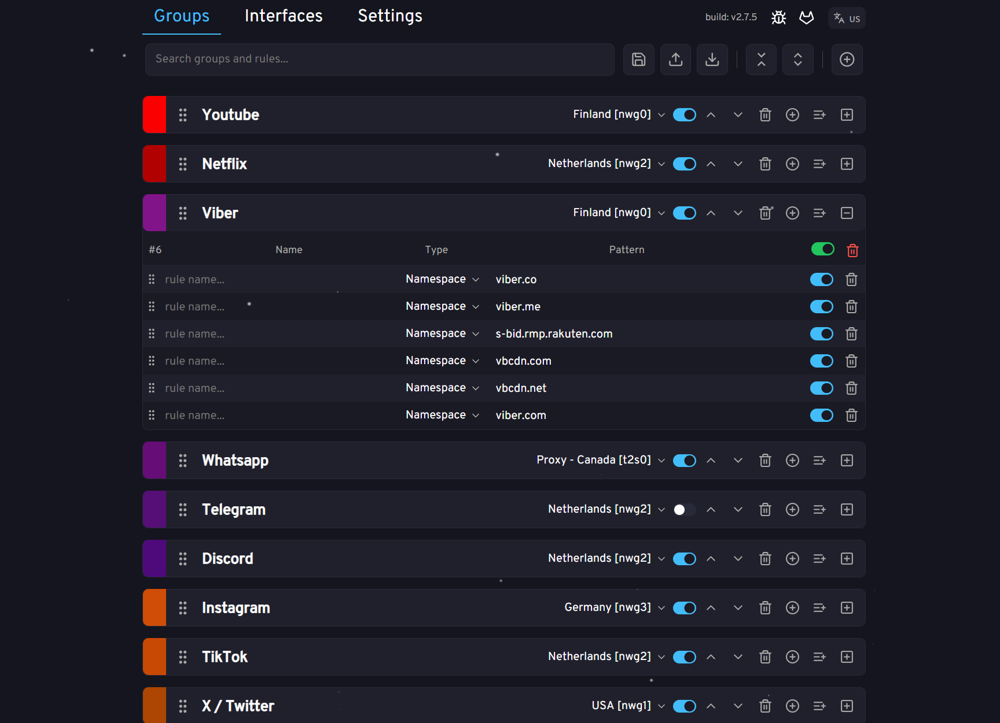
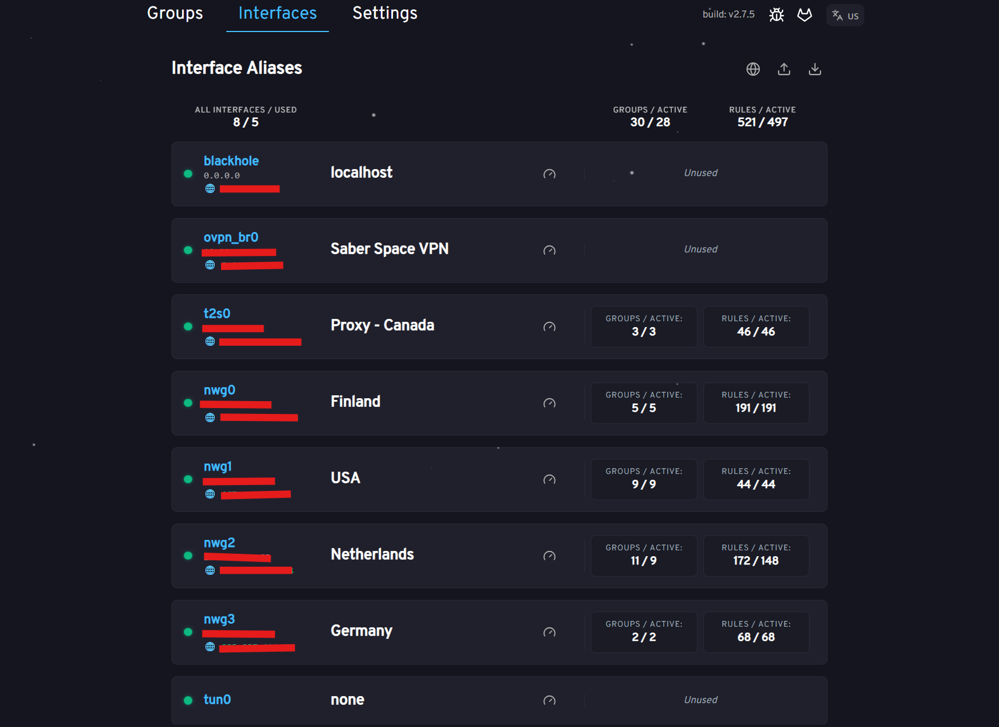
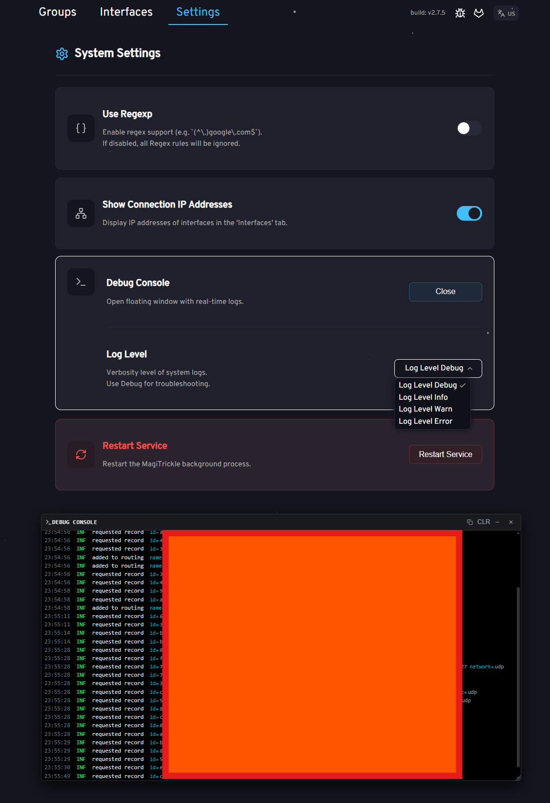
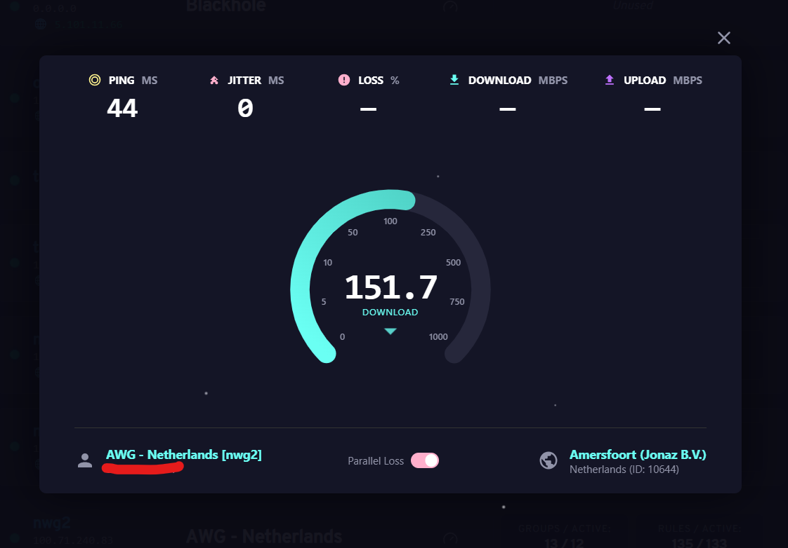

<p align="center">
  
</p>


MagiTrickle Mod
=======

## Назначение

**MagiTrickle Mod** — расширенная версия утилиты MagiTrickle для точечной маршрутизации трафика по заданным доменным именам. Представляет собой установочный пакет, устанавливаемый в дополнение к операционной системе маршрутизатора

Принцип работы основан на подмене основного DNS-сервера через промежуточный компонент без его отключения. Это позволяет перехватывать входящие DNS-запросы, кешировать ответы и сопоставлять IP-адреса с доменными именами. Благодаря этому становится возможной маршрутизация трафика без необходимости очистки DNS-кэша на стороне клиентов. Очистка кэша требуется только при запуске или перезапуске сервиса MagiTrickle, поскольку в этот момент кэш ещё не прогрет, и маршрутизация невозможна до первого запроса к нужному домену

### Отличия от оригинала (Mod Features)

#### 🚀 Производительность и Оптимизация
*   **Trie (Prefix Tree) Lookup**: Оригинал перебирает массив правил линейно. Мод использует префиксное дерево (Trie), что позволяет мгновенно находить нужный интерфейс даже среди тысяч доменов
// TODO: выбор режима работы (trie/linear) в зависимости от количества правил
*   **iptables**: Сокращение количества правил в таблице iptables за счет создания одного правила для всех групп с одинаковым интерфейсом. Как побочный эффект - быстрое сохранение конфига групп
*   Прочие улучшения работы при добавлении/удалении/включении/выключении групп и правил

#### 🛠 Улучшенный Интерфейс (UX)
*   **Вкладки (Tabs)**: Интерфейс разделен на логические вкладки: `Группы`, `Интерфейсы`, `Настройки`
*   **Interface Shortcuts**: Возможность задавать имена системным интерфейсам (`nwg0`, `ovpn_br0`)
*   **Mass Actions (Массовые действия)**:
    *   Выделение нескольких групп с Shift/Ctrl
    *   Массовое удаление, перемещение, **включение/выключение**, назначение интерфейса для групп и их удаление
    *   Возможность сворачивания/разворачивания всех групп
    *   Массовое **включение/выключение** правил внутри группы, а также массовое удаление правил
    *   TODO: массовое выделение правил; перетаскивание правил между группами; и т.п.
    *   Другие улучшения UI/UX
*   // TODO: Доработка **мобильного интерфейса** (на данный момент для мода не проводилась)

#### ⚙️ Новый Функционал
*   **Speedtest**: Встроенная утилита для замера скорости соединенияпрямо с роутера
    *   **Interface Binding**: Возможность проверить скорость **через конкретный интерфейс** (например, внутри VPN туннеля), игнорируя основной шлюз
*   **Auto-Update**: Система автоматической проверки и обновления версии мода прямо из веб-интерфейса
    *   Уведомления о выходе новых версий
    *   Обновление в один клик (без консоли)
*   **Regexp Toggle**: Возможность полностью отключить движок регулярных выражений в настройках (рекомендуемо автором мода)
*   **Логгер**: Встроенный просмотр логов (`ConsoleWindow`) прямо в веб-интерфейсе. Возможность менять уровень логирования в настройках
*   **Restart Service**: Возможность перезагрузки сервиса из веб-интерфейса

### Скриншоты (Screenshots)

| Группы (Main) | Интерфейсы (Interfaces) |
|:---:|:---:|
|  |  |

| Настройки (Settings) | Speedtest |
|:---:|:---:|
|  |  |

## Установка (Автоматическая)

Это рекомендуемый способ. Скрипт сам определит архитектуру вашего роутера, добавит репозиторий и подскажет команды для установки

> [!IMPORTANT]
> **Важно**: Если у вас установлен оригинальный `magitrickle`, удалите его перед установкой мода:
> ```bash
> /opt/etc/init.d/S99magitrickle stop
> opkg remove magitrickle
> ```

Выполните в консоли роутера:
```bash
opkg install wget-ssl ca-certificates
```
```bash
wget -qO- https://raw.githubusercontent.com/LarinIvan/MagiTrickle_Mod/develop/add_repo.sh | sh
```

После выполнения скрипта установите сервис командами:
```bash
opkg update
```
```bash
opkg install magitrickle_mod
```

**Затем запустите сервис**
```bash
/opt/etc/init.d/S99magitrickle start
```

**Дальнейшие обновления рекомендуется выполнять через веб-интерфейс**

## Веб-интерфейс
После запуска интерфейс будет доступен по адресу вашего роутера, порт **8080**
Например: `http://192.168.1.1:8080`

Конфигурация хранится в файле: `/opt/var/lib/magitrickle/config.yaml`

## Описание типов правил

### Namespace (Именное пространство)

Охватывает указанный домен и все его поддомены

Например, при записи `example.com` будут обрабатываться:
```
✅ example.com
✅ sub.example.com
✅ sub.sub.example.com
❌ anotherexample.com
❌ example.net
```

### Wildcard (Подстановочный шаблон)

Шаблон с `*` и `?` — позволяет задавать гибкие условия:
- `*` — любое количество любых символов
- `?` — ровно один любой символ

Например, при записи `*example.com` будут обрабатываться:
```
✅ example.com
✅ sub.example.com
✅ sub.sub.example.com
✅ anotherexample.com
❌ example.net
```

### Domain (Точный домен)

Правило применяется только к строго указанному домену, без поддоменов.

Например, при записи `sub.example.com` будут обрабатываться:
```
❌ example.com
✅ sub.example.com
❌ sub.sub.example.com
❌ anotherexample.com
❌ example.net
```

### RegExp (Регулярное выражение)

Для опытных пользователей. Используется парсер [dlclark/regexp2](https://github.com/dlclark/regexp2)

Например, при записи `^[a-z]*example\.com$` будут обрабатываться:
```
✅ example.com
❌ sub.example.com
❌ sub.sub.example.com
✅ anotherexample.com
❌ example.net
```
___________

> [!NOTE]
> **Это неофициальная модификация (Mod)**
> Данная версия развивается независимо, но при этом происходят регулярные слияния (merge) с оригинальным проектом. > Версионирование имеет вид `vX.X.X-(mod-Y.Y.Y)`, где `X.X.X` - версия оригинального проекта, которая была смержена в сборку, а `Y.Y.Y` - версия текущего проекта MagiTrickle_Mod
> Оригинальный проект: [gitlab.com/magitrickle/magitrickle](https://gitlab.com/magitrickle/magitrickle)